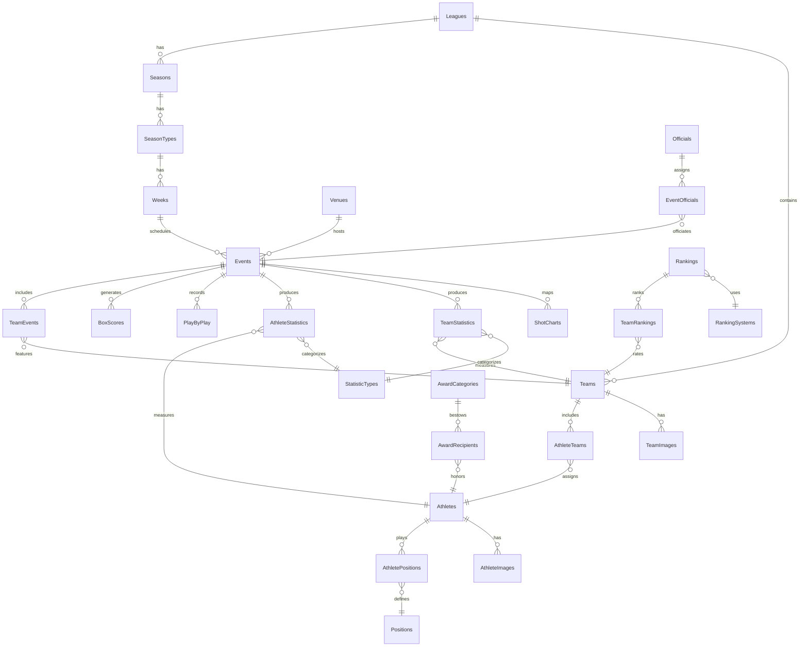

# Entity Relationships

This section outlines the key entity relationships in our ESPN API data structure, providing a conceptual model of how different tables and entities are connected.

## Core Entity Diagram

Below is a high-level entity relationship diagram showing the core entities and their relationships. This diagram focuses on the fundamental structure and omits many detail attributes for clarity.



## Primary Entity Groups

Our data structure is organized into several primary entity groups:

### Competition Structure

These entities define the organizational framework of sports competitions:

- **Leagues**: Top-level organization of a sport (e.g., NCAA Men's Basketball)
- **Conferences**: Groupings within leagues (e.g., ACC, Big Ten)
- **Divisions**: Sub-groupings within conferences
- **Seasons**: Time periods of competition (e.g., 2023-2024 season)
- **SeasonTypes**: Segments within seasons (e.g., Regular Season, Postseason)
- **Weeks**: Scheduled periods within season types

**Key Relationships:**
- Leagues contain many teams and span multiple seasons
- Seasons are divided into season types (regular season, playoffs)
- Season types contain weeks for scheduling purposes
- Conferences group teams within leagues

### Team Structure

These entities define the team framework:

- **Franchises**: The enduring organization that owns teams
- **Teams**: The actual competing entities within leagues
- **TeamSeasons**: The team's participation in a specific season
- **Groups**: Team groupings like divisions or pools

**Key Relationships:**
- Franchises represent the continuity of an organization across time
- Teams belong to franchises and participate in leagues
- TeamSeasons connect teams to specific seasons
- Groups organize teams for competitive purposes

### Participant Structure 

These entities define the people involved in competitions:

- **Athletes**: Individual participants in sporting events
- **AthleteTeams**: Relationships between athletes and teams over time
- **Positions**: Roles that athletes play in their sport
- **AthletePositions**: Assignment of athletes to specific positions

**Key Relationships:**
- Athletes belong to teams through the AthleteTeams junction
- Athletes are assigned positions through the AthletePositions junction
- These relationships are temporal (have effective dates)

### Event Structure

These entities define sporting events and their components:

- **Events**: Individual games or matches
- **TeamEvents**: Teams participating in specific events
- **Venues**: Locations where events take place
- **EventStatuses**: Current state of events (scheduled, in-progress, final)

**Key Relationships:**
- Events occur at venues and include multiple teams
- TeamEvents connects teams to specific events with home/away designation
- Events have many statuses over their lifecycle

### Statistics Structure

These entities track performance metrics:

- **StatisticCategories**: Groupings of related statistics (e.g., Offensive, Defensive)
- **StatisticTypes**: Specific measurable metrics (e.g., Points, Rebounds)
- **AthleteStatistics**: Statistics for individual athletes in events
- **TeamStatistics**: Statistics for teams in events

**Key Relationships:**
- Statistic types belong to categories
- Athlete and team statistics are always connected to specific events
- Statistics are categorized by type and attach to either athletes or teams

## Detail-Level Relationships

Beyond the high-level relationships, we maintain several important detail relationships:

### Temporal Relationships

Many relationships in sports data are temporal in nature:

- **AthleteTeams**: Athletes change teams over time
- **TeamConferences**: Teams change conference affiliations
- **CoachingStaff**: Coaches change roles and teams

These are modeled with effective dating (`effective_from` and `effective_to` columns) to maintain historical accuracy.

### Hierarchical Relationships

Several entities have hierarchical structures:

- **Leagues → Conferences → Divisions**
- **StatisticCategories → StatisticTypes**
- **Venues → Sections → Seats**

These are modeled with self-referencing foreign keys or through junction tables.

### Specialized Relationships

Some domains have specialized relationships:

- **Tournament Structure**: Brackets, rounds, and matchups
- **Rankings**: Poll systems, voters, and ballots
- **Broadcasts**: Networks, announcers, and coverage areas

## Relationship Types

Our data model employs several types of relationships:

### One-to-Many Relationships

These are the most common relationships:

- One league has many teams
- One team has many athletes (through AthleteTeams)
- One venue hosts many events

These are implemented with foreign keys in the "many" table pointing to the "one" table.

### Many-to-Many Relationships

These relationships require junction tables:

- Athletes to Teams (through AthleteTeams)
- Events to Teams (through TeamEvents)
- Teams to Seasons (through TeamSeasons)

Each junction table contains foreign keys to both related entities and often includes additional attributes about the relationship.

### One-to-One Relationships

Used sparingly for logical separation of concerns:

- Events to EventDetails (additional metadata about events)
- Athletes to AthleteDetails (additional metadata about athletes)

These are implemented with either shared primary keys or unique foreign keys.

## Referential Integrity

Our database enforces referential integrity through foreign key constraints:

- **ON DELETE RESTRICT**: Default policy to prevent orphaned records
- **ON DELETE CASCADE**: Used selectively for certain child tables
- **ON UPDATE CASCADE**: Used for primary key changes (rare)

Foreign key constraints are documented in each table's definition.

## Practical Query Paths

Common query patterns follow these relationship paths:

1. **Athlete Career Analysis**:
   ```
   Athletes → AthleteTeams → Teams → TeamSeasons → Seasons
   ```

2. **Event Box Score Retrieval**:
   ```
   Events → AthleteStatistics → Athletes
   Events → TeamStatistics → Teams
   ```

3. **Season Standings**:
   ```
   Seasons → TeamSeasons → Teams → TeamStatistics
   ```

4. **Head-to-Head Matchups**:
   ```
   Teams → TeamEvents → Events → TeamEvents → Teams
   ```

## Additional ERD Diagrams

For more detailed relationship diagrams on specific domains, see:

- [Statistics Structure](statistics-structure.md)
- [Play-by-Play Data](play-by-play.md)
- [Rankings Structure](rankings-structure.md)
- [Tournament Structure](tournament-structure.md) 